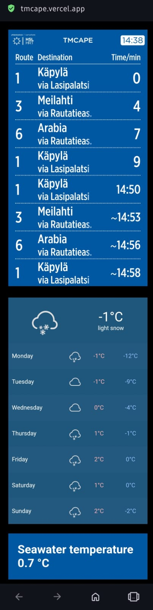

# HomeDashboard
 
This is quickly drafted dashboard for my private use to easily access most used information related to my home location at Helsinki, Finland.
Dasboard is only optimized for mobile use.

Dashboard includes HSL my stop displays display for the nearest tram stops thowards city center.  
You can make your own at **omatnaytot.hsl.fi**
project specific display can be found from **omatnaytot.hsl.fi/static?url=965bcc5e-cfcd-5495-a806-b884172553e9**

Weather widget comes from **https://weatherwidget.io**

Third component fetches water temperature data from **https://uiras.fvh.io** or more specifically from **https://iot.fvh.fi/opendata/uiras/**

